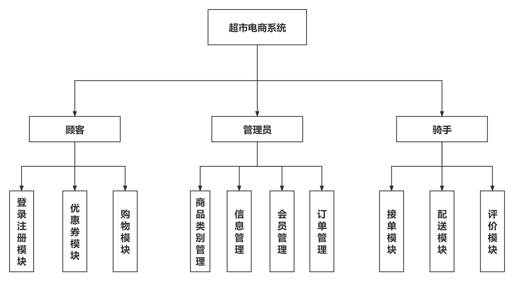

# E-supermarket

## Introduction
Front-end and back-end separated supermarket e-commerce system

In this system, we store all the information of merchants' products and users. After registering and logging in to our website, users can choose the products they want according to their preferences, or they can use the search function to find the exact products they want. After adding an order and completing the checkout process, the product information is instantly transferred to the respective merchant so that the product can be shipped. The administrator can clearly view each order information and the sales of specified products in the background, so that he can change the strategy in operation and better manage his store. Our system has a clear division of labor, including different levels of users, order managers, user administrators and other levels. Compared with previous shopping sites, our online supermarket shopping system will be more user-friendly and agile.

## Technology Stack

- HTML5
- JavaScript
- CSS
- Vue
- Node.js
- MySQL
- MyBatis
- MyBatis
- Redis
- Elastic Search
- Apache Tomcat

## Functional Module Diagram

## Functionality

**Customer:**

**General functions:**

1. Login page: login, change password, create account, register

2. Settings: Logout login, About us

**My:**

1. personal center: modify personal information, change password, membership and points information

2. Points: current points, coupon details, automatic processing of points changes

3. My orders: purchased orders, in transit orders, cancelled orders, order details

4. after-sales service: online orders can be cancelled within a limited time

**Commodity:**

1. Browse products: price sorting, filtering according to brand and price range

2. product details: product description, product information, product parameters

3. product purchase settlement, order status

4. coupons and coupon recommendations

5. shopping cart function

6. second kill function

**Administrator**: (product administrator and user and order administrator)

**Basic functions:**

1. login registration, password management

2. settings: exit login, etc.

**Commodity management**

1. filter, query product information: search by category, brand, item number 

2. display product data list: item number, picture album, brand, classification

3. Upload goods (fill in basic information)

4. Edit products (downlist, modify basic information)

**User order management**

1. filtering, query orders: according to pending payment, shipped, completed, closed filtering; by order number, consignee, submission time query

2. display basic order information: order number, order time, user account, order amount, order status, order notes

3. Edit operation: modify the consignee information, refund and return, cancel the order

**User Membership Management**

1. filtering, query users (account query, registration time sorting, points sorting, etc.)

2. display: basic information (account number, nickname, registration time, membership level, consumption amount, order quantity, available points, order record)

3. Edit operation: change points, change membership level, modify basic information, disable account, etc.

**Rider side**

1. show available orders, and take orders

2. show the history of orders

3. show rider's basic information, number of orders received, rating

#### Contribute

1. Fork this repository
2. Create a new Feat_xxx branch
3. Submit code
4. Create a new Pull Request

